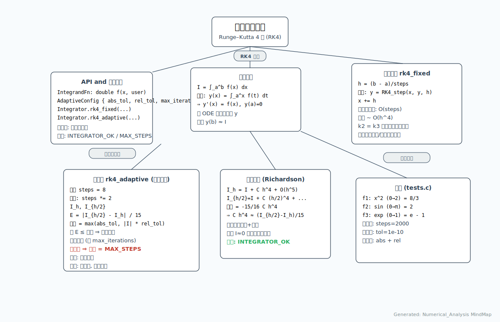

# Numerical_Analysis 项目说明

> 本仓库：演示使用 Runge–Kutta 四阶 (RK4) 方法做定积分数值近似，包括固定步长与自适应步长（通过双网格 Richardson 误差估计）。

配套文件结构：

| 文件 | 作用概述 |
|------|----------|
| CMakeLists.txt | 构建配置，设置 C11 与编译参数、输出目录 |
| integrator.h   | 对外 API（IntegrandFn / 自适应配置 / 状态 / Integrator 结构） |
| integrator.c   | RK4 固定步长与自适应实现（积分转化为 ODE y' = f(x), y(a)=0） |
| tests.h / tests.c | 简单测试框架与 3 个示例函数 (x^2, sin, exp) 的验证 |
| main.c         | 程序入口：运行测试 + 示例打印 |
| docs/Integrator_MindMap.svg | 思维导图（算法与流程结构可视化） |

---
## 1. 核心思想
定积分 I = ∫_a^b f(x) dx 可通过引入辅助函数 y(x) = ∫_a^x f(t) dt，将问题写成初值常微分方程：

```
y'(x) = f(x),  y(a) = 0
```

使用常见 ODE 数值法（这里选 RK4）对 y 在区间 [a,b] 递推，最终 y(b) 即为积分值。

---
## 2. RK4 单步公式回顾
对 ODE y' = f(x)，步长 h：

```
k1 = f(x)
k2 = f(x + h/2)
k3 = f(x + h/2)
k4 = f(x + h)
y_{n+1} = y_n + (h/6) (k1 + 2k2 + 2k3 + k4)
```

注意：本实现中 k2 与 k3 直接复用（若函数计算极其昂贵，可再独立计算；对常规 f 差异极小）。

局部截断误差 O(h^5)，全局误差 O(h^4)。

---
## 3. 固定步长实现 (rk4_fixed)
- 给定 steps，将区间长度 L = b - a 划分为 h = L / steps。
- 循环 steps 次，每次调用 rk4_step 递推。
- 时间复杂度 O(steps)，函数评估 ~ 4 * steps（本实现复用 k2=k3 ⇒ 实际 3 次 + 1 次 = 4 次；若不复用则 4 * steps）。

适合：函数平滑 + 需要可控成本 + 足够大 steps。

---
## 4. 自适应积分 (rk4_adaptive)
策略：全局序列细化（非局部自适应网格）。
1. 初始步数 steps = 8；计算 I_h。
2. 将步数加倍 steps *= 2，计算 I_{h/2}。
3. 误差估计：
   - 对四阶方法，双网格误差估计 E ≈ (I_{h/2} - I_h) / 15。
4. 判断 |E| <= max(abs_tol, |I_{h/2}| * rel_tol) 则收敛。
5. 否则继续加倍，直到达到最大迭代次数。

特点：
- 简洁（无需局部误差控制/回退）。
- 若函数有局部剧烈变化，效率不如“局部自适应/分裂”策略。
- 适合中等精度、快速原型。

改进方向（未实现）：
- 分段递归 (adaptive Simpson / recursive RK)。
- 误差控制加入安全因子 + 动态预测步数。
- 奇异点处理（变换变量）。

---
## 5. 容差与状态
结构 AdaptiveConfig：
- abs_tol：绝对误差下限。
- rel_tol：相对误差约束。
- max_iterations：全局网格加倍次数上限（指数增长）。

状态 IntegratorStatus：
- INTEGRATOR_OK：在容差内成功。
- INTEGRATOR_MAX_STEPS_REACHED：迭代结束仍未满足容差（返回最新估计）。

---
## 6. 测试 (tests.c)
3 组案例：
1. f(x)=x^2, ∫_0^2 = 8/3
2. f(x)=sin x, ∫_0^π = 2
3. f(x)=e^x, ∫_0^1 = e - 1

逐个执行：
- fixed: steps=2000
- adaptive: 容差 1e-10 / 迭代上限 24
- 检查固定/自适应与解析值的绝对+相对组合容差

---
## 7. main.c 流程
1. 设置控制台编码 (Windows 下 CP_UTF8)。
2. 调用 run_all_tests() 打印验证信息。
3. 对 f(x)=x^2 再演示：
   - 固定步长 steps=4000
   - 自适应 (1e-12, 1e-12, 28)
4. 打印：固定结果 / 自适应结果 / 解析解 / 相对误差。

---
## 8. 性能与数值讨论
- RK4 对光滑函数收敛速度较快：误差 ~ O(h^4)。
- 自适应策略由于是“全域加倍”，当函数足够光滑时，与一次设定较大 steps 的成本接近。
- 单精度 vs 双精度：当前使用 double，误差容限 1e-12 附近时逐渐接近浮点极限（差值放大、消除现象）。
- 如果需要极高精度，可用：
  - 高阶方法 (RK6/RK8)；
  - 任意精度库 (MPFR)；
  - 分裂自适应。

---
## 9. 可能的扩展
- 添加 Simpson / Romberg / Gauss-Legendre。
- 局部自适应：递归划分区间（含误差再分）。
- 向量值积分（多维 f）：包装结构传递多个分量。
- 多线程：分块固定步长求和再规约（注意自适应策略需协调误差估计）。

---
## 10. 构建与运行
假设已安装 CMake 与合适的 C 编译器：

```bash
cmake -S . -B build
cmake --build build --config Release
./build/bin/Numerical_Analysis   # Windows 下为 build\\bin\\Numerical_Analysis.exe
```

---
## 11. 思维导图
见：`docs/Integrator_MindMap.svg`



---
## 12. 代码片段示例（调用）
```c
#include "integrator.h"

double my_func(double x, void *u) { (void)u; return x*x + 1.0; }

int main() {
    double val_fixed = Integrator.rk4_fixed(my_func, NULL, 0.0, 1.0, 1000);
    IntegratorStatus st;
    double val_adap = Integrator.rk4_adaptive(my_func, NULL, 0.0, 1.0,
        (AdaptiveConfig){1e-9, 1e-9, 20}, &st);
    return 0;
}
```

---
## 13. 精度与误差估算要点
- 双网格 E = (I_{h/2}-I_h)/15 借助阶数 p=4 的 Richardson：
  - 假设 I_h = I + C h^4 + O(h^5)
  - I_{h/2} = I + C (h/2)^4 + ... = I + C h^4/16
  - 差值 I_{h/2} - I_h = C h^4 (1/16 - 1) = -15/16 C h^4
  - 反推 C h^4 ≈ (I_{h/2} - I_h)/(-15/16) ⇒ 真实误差 ~ (I_{h/2} - I_h)/15
- 终止准则使用 max(abs_tol, |I| * rel_tol) 避免真实值接近 0 时“相对误差放大”。

---
## 14. 安全/鲁棒性注意
- steps <= 0 立即返回 0.0（避免除零）。
- a == b 直接返回 0.
- max_iterations / 容差为非正时给默认值（防止用户忘填）。
- 未对 (b < a) 做反转，可扩展：若 b < a 则交换并取负号。
- 对潜在非有限 (NaN/Inf) 没有特别防护，可在上层封装判定。

---
## 15. 附：思维导图（文本版）
```
数值积分 (本项目)
├── API 设计
│   ├── IntegrandFn (f(x), user)
│   ├── AdaptiveConfig (abs_tol, rel_tol, max_iterations)
│   └── Integrator (rk4_fixed / rk4_adaptive)
├── 核心算法
│   ├── 积分转 ODE y' = f(x)
│   ├── RK4 单步 (k1..k4)
│   └── 自适应：双网格加倍 + Richardson 误差
├── 文件结构
│   ├── integrator.h / integrator.c
│   ├── tests.c / tests.h
│   ├── main.c
│   └── CMakeLists.txt
├── 流程 (自适应)
│   1 初始 steps=8 求 I_h
│   2 步数加倍求 I_{h/2}
│   3 估计误差 E=(I_{h/2}-I_h)/15
│   4 判断 E <= tol ⇒ 收敛
│   5 否则迭代直到上限
└── 扩展方向
    ├── 更多积分算法
    ├── 局部细化
    ├── 并行化
    └── 高阶 / 任意精度
```

---
## 16. 许可与引用
（此示例未附加许可证；若公开发布建议添加 LICENSE 文件。）

---
如需进一步扩展（如添加 Simpson 自适应或支持负向区间），可提出具体需求。

